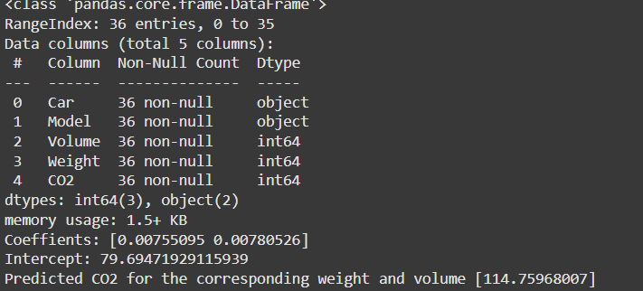

# Implementation of Multivariate Linear Regression
# Date: 20-12-2024
## Aim
To write a python program to implement multivariate linear regression and predict the output.
## Equipment’s required:
1.	Hardware – PCs
2.	Anaconda – Python 3.7 Installation / Moodle-Code Runner
## Algorithm:
### Step1
Import pandas for data manipulation and linear_model from sklearn for regression.

### Step2
Load the CSV file carsemission.csv into dataframe using pd.read_csv

### Step3
Define X as a dataframe containing the weight and volume columns. Define uy as the CO2 column which is the value to predict.

### Step4
Create a linearRegression().Train the model with the data by calling regr.fit(X,y)

### Step5
Acess model coefficients with regr.coef_,showing the ewight of each feature. Access the intercept term with regr.intercept_,reqresenting the baseline CO2.

### step6
create a dataframe input_data with new values for weight and volume. use the regr.predict(input_data) to predict CO2for the input features.

### step7
End the program.

## Program:
Developed by :Maha shree.M
Register number: 24900438
```
    import pandas as pd
    from sklearn import linear_model
    df=pd.read_csv("carsemission.csv")
    df.info()
    df.head()
    df.tail()
    X=df[['Weight','Volume']]
    y=df['CO2']
    regr=linear_model.LinearRegression()
    regr.fit(X,y)
    print('Coeffients:',regr.coef_)
    print('Intercept:',regr.intercept_)
    predictedCO2=regr.predict([[3300,1300]])
    print('Predicted CO2 for the corresponding weight and volume',predictedCO2)
```
## Output:


## Result
Thus the multivariate linear regression is implemented and predicted the output using python program.